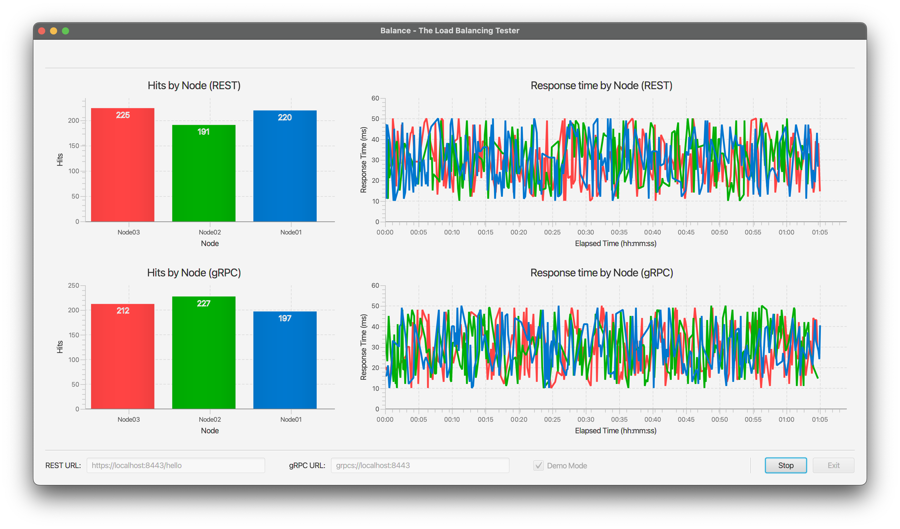

# Balance
### A visual Load Balancing Tester

Graphical interface to display real-time load balancing behavior of API endpoint deployed in a cluster.
Uses the [vkube-hello](https://github.com/avermak/vkube-hello) repo as the provider for REST+gRPC endpoints.

## Prerequisites
- The helloworld API provided by the [vkube-hello](https://github.com/avermak/vkube-hello) repository must be deployed
  in a cluster.
- The API endpoints of the cluster deployment must be exposed external to the cluster and accessible by the machine where this UI client will be running.

## Charts
1. Hits by Node - REST
2. Response Time by Node - REST
3. Hits by Node - gRPC
4. Response Time by Node - gRPC

